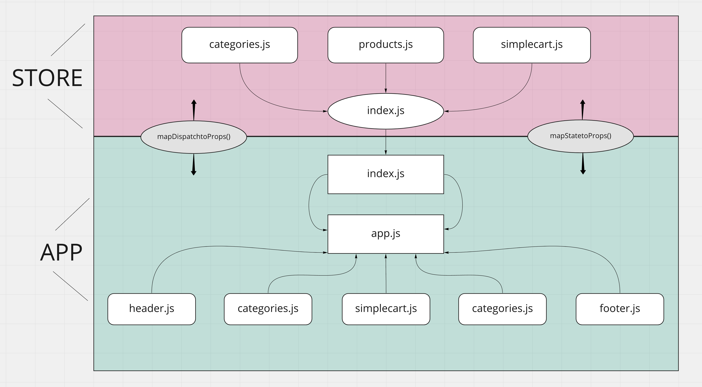

# storefront

Author: Jessi Velazquez

*Heroku is charging me more than I thought to host, so I pulled down the deployment of this project, please clone and run locally instead:*

## How to Run This Project:
1. Copy the HTTPS or SSH string for this repository in the upper right here on Github.
2. Open terminal, run 'git clone <copied URL>.
3. Run 'npm install' to install dependencies.
4. Run 'npm run start', this should bring up the project locally at port 3000. If not, navigate to https://localhost:3000.

The back end of this project is the API I have built in this repo: [https://github.com/JessiVelazquez/api-server](https://github.com/JessiVelazquez/api-server). It is hosted at [https://api-server-jessi.herokuapp.com/store](https://api-server-jessi.herokuapp.com/store).

PR: [https://github.com/JessiVelazquez/storefront/pull/24](https://github.com/JessiVelazquez/storefront/pull/24)

## Overview and Description

An E-Commerce storefront using React with Redux, coupled with its own live API server. We can add or remove items from our cart, both from the main product category pages or from a "details" page for each product. We can view the cart on the "cart" page and see total cost. There is also a form on the cart page that allows a user to initiate the order process.

## UML

